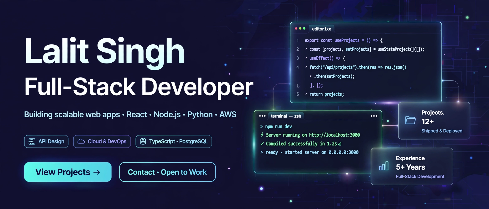
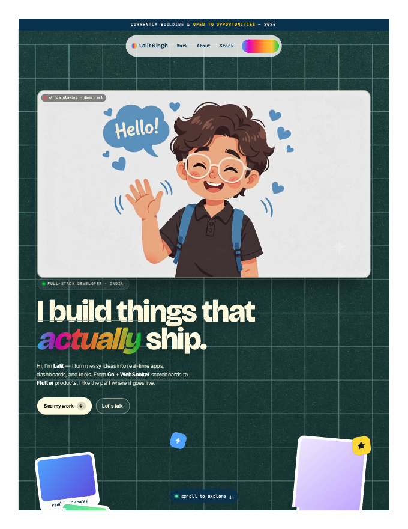

# Lalit Singh — Full-Stack Developer (Portfolio)

> ## Status: 🟢 Completed
>
> <progress value="85" max="100"></progress>
> **Progress: 85%** — Complete animated portfolio; static files verified.

<p align="center">
  
</p>


## Screenshots

<p align="center">
  
  <br />
  <em>Portfolio site.</em>
</p>


## What it is

A personal developer portfolio for Lalit Singh — "Real-time systems, Flutter apps, and things that actually ship." A single-page site with a film-grain texture, a one-time guided-tour cursor sweep, a live scroll guide, an "open to opportunities" announcement bar, and scroll-driven section reveals. Styling uses Bricolage Grotesque, Inter Tight, JetBrains Mono, and Caveat typefaces. A tiny Python dev server disables caching so CSS/JS edits show on every reload.

## What works (verified)

- ✅ Full page renders — hero, announce bar, tour cursor, scroll guide — `index.html` (377 lines)
- ✅ Guided-tour cursor sweep + scroll-to-next-section guide — `main.js` (454 lines)
- ✅ Grain overlay, custom fonts, responsive styles — `styles.css` (686 lines), `theme.css`
- ✅ No-cache dev server on port 4321 — `server.py` (verified by code read; trivially runnable)
- ✅ Design tokens and theme variables — `tokens.json`, `variables.css`

> Verified by reading all source files. The site is static — open `index.html` or run `server.py`.

## Tech stack

| Layer | Tech |
|---|---|
| Markup | HTML5 |
| Styling | Vanilla CSS + CSS variables, Google Fonts |
| Logic | Vanilla JavaScript |
| Dev server | Python `http.server` with no-cache headers |

## How to run

```bash
# Dev server (no stale CSS/JS surprises)
python3 server.py
# → http://localhost:4321

# Or just open the file
open index.html
```

## Screenshots

No screenshots ship with the repo (there are `assets/`, `Portrait`, and `Superr` media folders — check them for brand assets). The banner above is the visual.

## What you can add more

- [ ] Projects section with live links — the portfolio's proof of work
- [ ] Blog/writing section — "things that actually ship" deserves stories
- [ ] Contact form or booking link — "open to opportunities" needs a call to action
- [ ] Dark/light theme — currently a single fixed theme
- [ ] Performance pass — `hello.mp4` and large assets may slow first paint
- [ ] `prefers-reduced-motion` — the tour cursor and reveals ignore it

## Project structure

```
Portfolio2/
├── index.html     # Page structure (hero, sections, tour cursor)
├── main.js        # Tour sweep, scroll guide, reveals
├── styles.css     # Main styling
├── theme.css      # Theme layer
├── tokens.json    # Design tokens
├── variables.css  # CSS variables
├── server.py      # No-cache dev server (port 4321)
├── assets/        # Media assets
├── Portrait/      # Portrait assets
└── Superr/        # Additional assets
```

---
*README written after code audit on 2026-10-08.*
